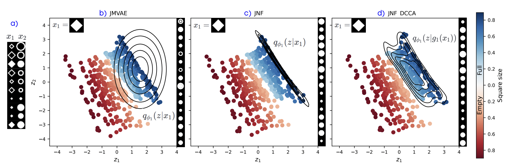

# JNF and JNF-DCCA : Multimodal Variational Autoencoders with Normalizing Flows and Correlation Analysis

This repository contains the code to reproduce some of the experiments in our paper "Improving Multimodal Variational Autoencoders with Normalizing Flows and Correlation Analysis."

## Setting up the virtual environment 

Set an virtual environment with python38 and install all the necessary dependencies by running (from the /multimodal_vaes/ folder)
    pip install -r requirements.txt
Also install our package (bivae) by running :
    pip install -e . 

## Generate the data

For the MNIST-SVHN dataset, run from inside the repo/multimodal_vaes/ folder:

    python bin/make-mnist-svhn-idx.py 

This create the pairs of data with matching labels.

For the MNIST-SVHN-FashionMNIST dataset, run from inside the repo/multimodal_vaes/ folder:

    python bin/make_trimodal.py

For the CelebA64 dataset, download the data by running (from the repo/multimodal_vaes/ folder) :

    python bin/download_celeba.py

All data will be save in the repo/data/ folder. 

## Launching experiments

We provide files to easily launch the trainings of our models from the command line. 

To train a model, uncomment the corresponding line in *train.sh* and then run
    bash train.sh 
from inside the /multimodal_vaes/ folder. 
By default the JNF command line for the MNIST-SVHN dataset is uncommented. 

If you want to train the JNF-DCCA model, the DCCA encoders must be trained beforehand. 
To do so, comment out the right line in *train_dcca.sh* and run (from inside the repo/multimodal_vaes/ folder):
    bash train_dcca.sh

All the models configurations are in repo/multimodal_vaes/configs_experiments/.
Feel free to play around with the parameters of the trainings. 

The models and some images to monitor the trainings are saved in the repo/experiments/ folder. 

Our codes integrate wandb monitoring. To use it, set wandb online at the beginning of the *train.sh* file and *train_dcca.sh* file.

## Compute validation metrics

You might want to evaluate the trained models by computing coherences, FIDs, likelihoods...
Beforehand, you need to train the relevant classifiers to evaluate the coherences. 

To do so, you need to run these command lines from inside the repo/multimodal_vaes/ folder. 

For MNIST;
    python src/bivae/analysis/classifiers/classifier_mnist.py --mnist-type numbers
For SVHN;
    python src/bivae/analysis/classifiers/classifier_SVHN.py
For FashionMNIST;
    python src/bivae/analysis/classifiers/classifier_mnist.py --mnist-type fashion
For CelebA
    python src/bivae/analysis/classifiers/CelebA_classifier.py

We set a small number of epochs (15) in this demonstration to limit the running time, but you can modify this parameter in the scripts. 

To compute the $\mathrm{FID}$ values, you also need to download the Inception Network weights :
    python src/bivae/analysis/pytorch_fid/download_fid_weights.py

Once you've trained the classifiers, you can compute validation metrics and likelihoods with the *eval.sh* script or the *compute_likelihoods.sh* script.
Just comment out the model you want to evaluate and run (from inside the multimodal_vaes folder):
    bash eval.sh
or 
    bash compute_likelihoods.sh

